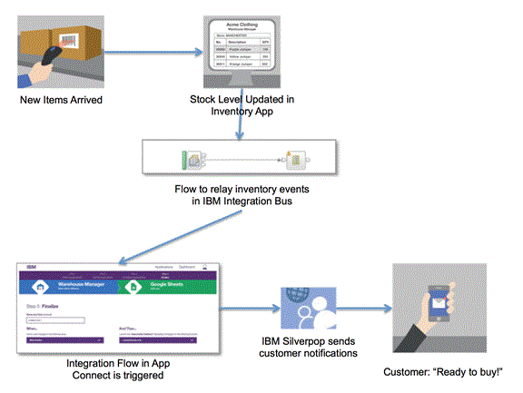
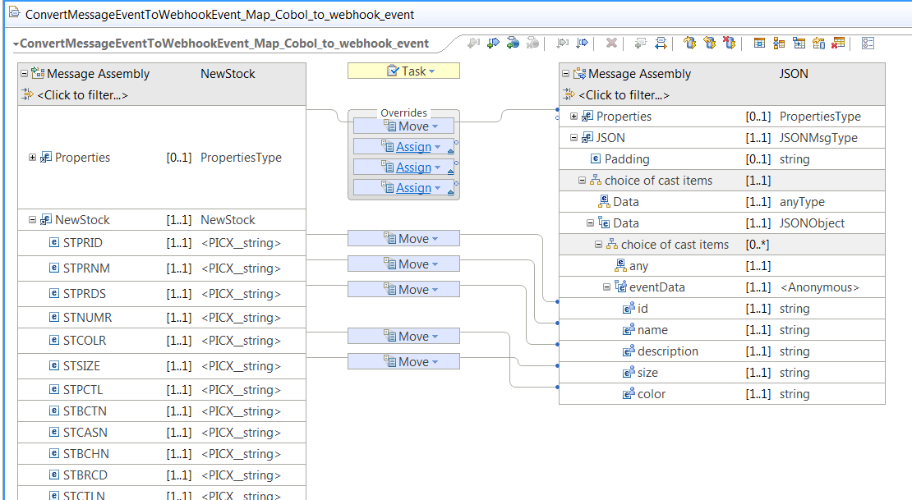

# Explanation of Warehouse sample
A detailed explanation of what the Warehouse sample is showing and how it was constructed.

## Introduction
The Warehouse sample shows how you can use IBM App Connect and IBM Integration Bus (IIB) to integrate a backend on-premises system with another system.

Let's first take a look at the use case before diving into the detail.

## Setting the scene

A retail company has an online store. The inventory for the company is managed by commercial software that keeps track of the stock levels for each item that is sold through the online storefront. The IT department uses IBM Integration Bus to keep the inventory system in sync with other systems such as procurement, order fulfilment, and shipping.

Now the marketing department wants to organize some campaigns around a few popular items. Because these items are in short supply, the inventory has been consistently low and the department wants to engage with customers who have visited the store and searched for these items, but found that they were out of stock.

So the idea is to send instant notifications to these customers as soon as the inventory application has updated the stock for the items. The flow of data through the system when a new stock item event occurs is as follows:

1.	Inventory management application fires the stock increase event
2.	An integration flow in IBM Integration Bus (IIB) picks up this event and passes it along to IBM App Connect
	*	For this to happen, you must first configure an application in IBM App Connect to subscribe to this event.
3.	An integration flow in IBM App Connect picks up the event and passes it along to the digital campaign application for customer engagement, such as Marketo or IBM Silverpop
4.	Customers get personalized notifications via digital channels like email, phones, SMS, etc.



Note: For simplicity, the Warehouse sample uses Google Sheets as the target action in the place of IBM Silverpop. The goal is to get the newly stocked items to show up in a Google Spreadsheet as a new row. This simulates the API call to IBM Silverpop to notify customers of the stock level update.

## How App Connect and IIB work together

App Connect allows the user to define additional Applications, which are sources of events. To add an application, you need a source of events and an Application Definition file describing the event contents. One type of event source which can be used is a Webhook pattern, where App Connect registers an interest and is called back via REST each time an event occurs.

The messageflow in IBM Integration Bus that mediates between the Warehouse app and App Connect implement a Webhook event source pattern. Webhook is a popular pattern for cloud applications to support external event pub/sub. In a Webhook pattern, the event source publishes a URL for subscribers to register an HTTP POST callback. When the event happens, the event source, which in this scenario is the IIB integration flow for handling stock level updates in the inventory application, pushes the event to the subscribers by using the callback POST URL.

The Warehouse sample uses an IIB library (`IIBtoAppConnectWebhookLib`) to construct a well-defined webhook REST interface. This is exactly the type of webhook interface that App Connect can integrate with. If you want to create your own flows that integrate with App Connect then you can use this library 'as is' or you can create a flow from scratch that implements the same webhook pattern. The full REST API implemented by the library can be found in: [IIB webhook specification](./IIB_webhook_description.md).

Currently, App Connect can not interact with any arbitrary implementation of the Webhook pattern so you must write flows that provide this REST interface either explicitly, by using the sub flow provided in the IIB library `IIBtoAppConnectWebhookLib`, or by constructing your own flows with the correct HTTP nodes and logic to provide exactly the same REST interface.


## How it all fits together
To get the flow of data from a new stock event to a customer notification requires three main steps:

* Developing an IIB message flow that receives an event from the warehouse system and sends parts of the event to App Connect by using a WebHook pattern.
* Creating an Application Definition file which represents the event format emitted by the flow.
* Using the Application Defnintion file to add a new application to App Connect that represents the Warehouse application and provides a list of events with data structures that can trigger an App Connect flow.
* Creating a flow in App Connect that uses the new Warehouse application and, when triggered by an event from the Warehouse, performs an action on another application (in this case, create a row in a Google Sheets spreadsheet).

Each of these steps is discussed in turn. When you are happy with how the sample works you can try [deploying and running the Warehouse sample on IIB and App Connect](./runwarehouse.md).    

### Developing the IIB Message flow
Lets take a look at what is involved in creating a message flow that can receive events from a system and then send them to App Connect. The project `WarehouseNewStockEventToAppConnect` contains the simple message flow that is used in the Warehouse sample and has all the essential elements require to acheive this:


The first part of the message flow contains everything required to interact with Warehouse system. In general this can be as complicated as required and can use any of the many built-in functions in IIB. In the Warehouse case it is a simple HTTPInput node that receives an HTTP POST and parses the incoming data as a COBOL copybook structure that is defined in a DFDL message set. The flow can be modified to receive the same event from MQ, a file, SAP, or any other system that IIB can interact with. The key point is that this part of the flow is just normal IIB development.

In order to interact with App Connect, the incoming data structure is mapped to a data structure that App Connect can understand. Currently, this is a flat JSON structure that is comprised of a set of name-value pairs. The IIB flow maps from the complex COBOL structure to the simplified App Connect structure:



The final part of the flow uses the webhook pattern to send an event to App Connect. This is done by using the subflow that is provided in `IIBtoAppConnectWebhookLib` called `WebhookOutput.subflow`.
There is no need to worry about the exact details of the subflow (unless you want to take a look). The important properties are displayed as promoted properties on the subflow:

* EventType - the name of the event that is sent to App Connect. In the case of the Warehouse sample this is `newStock`.
* WebhookBaseUrl - the URL that is used to register for events from this webhook. It is NOT the url that is actually called to send the event but instead the URL to POST the callback URL to.
* WebhookStarUrl - must be identical to WebhookBaseUrl except suffixed by `/*`. This is only required due to a limitation in how properties are promoted from a subflow.

The last node in the flow is an HTTPReply node and is used to send a reply back to the original HTTP request in the flow.

Once the flow is constructed, it can be deployed to a IIB server and is ready to run. Because App Connect registers its callback URL dynamically there is no link between IIB and App Connect until the App Connect application is configured.

### Creating the Application Definition file representing the event source

To setup App Connect to comunicate with IIB and register with the webhook, the IIB flow developer needs to create a document that completely defines the details of the webhook. The Warehouse sample uses the following document: [Warehouse Webhook definition file](./warehousedefinition.yaml).

The document is written in Swagger syntax (http://swagger.io) which is in yaml format. You can review the content in a text editor, or for a better presentation open the online [Swagger editor](http://editor.swagger.io/).


The key parts of the document are the POST URL (for the subscriber registration) and the event data format.

* Webhook subscriber registration:
```
POST /warehouse/stock/hook
```
* Event data format:
```
Product:
  type: object
  properties:
    id:
      type:  string
    name:
      type:  string
    description:
      type:  string
    color:
      type:  string
    size:
      type:  string
```

### Adding a new 'Warehouse' application in App Connect
Creating the new App Connect application that represents the Warehouse integration in IIB is very simple. You log in to the App Connect system and upload the Application Definition file via the Applications panel. This results in a new application that can be used as a source application in an App Connect flow.

### Creating a flow in App Connect that uses the 'Warehouse' application as the source application
In AppConnect, you create a flow that uses the Warehouse application as the source application and Google Sheets as the target application. Then you configure the event that triggers the flow, and choose the data that you want to add to the Google Sheets spreadsheet when the flow is triggered.

If you want to try the sample, see [How to setup and run the Warehouse sample](./runwarehouse.md).


## Reference
For IIB to interact with App Connect it needs to implement a Webhook pattern. There are example artefacts in `IIBtoAppConnectWebhookLib` that do this for you but you can construct this any way you like as long as it conforms to the following spec:

* [IIB webhook specification](./IIB_webhook_description.md)
